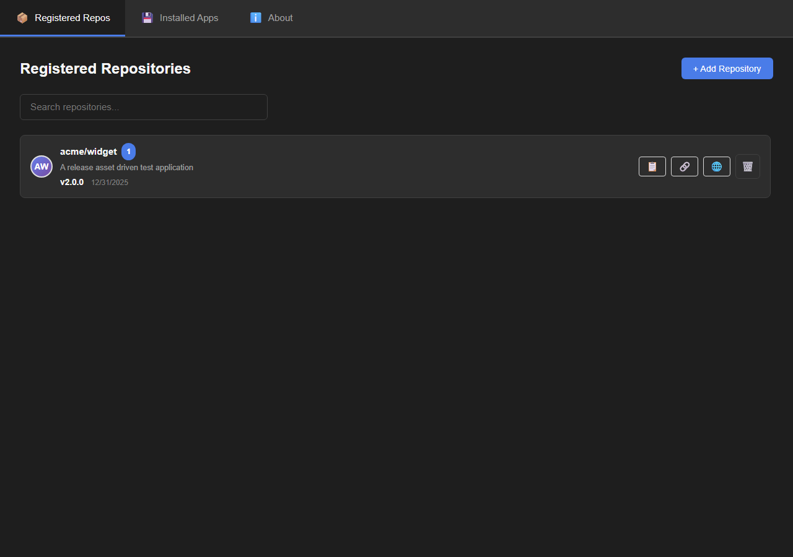
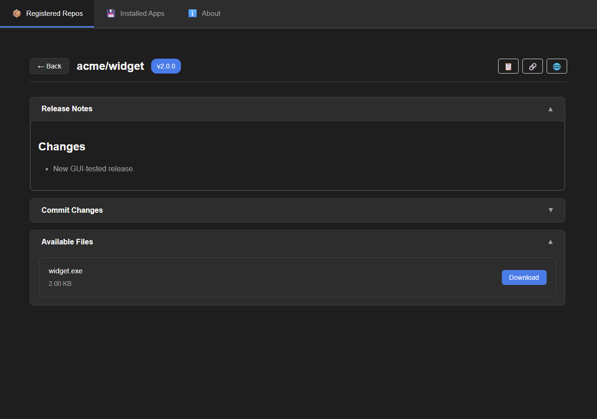
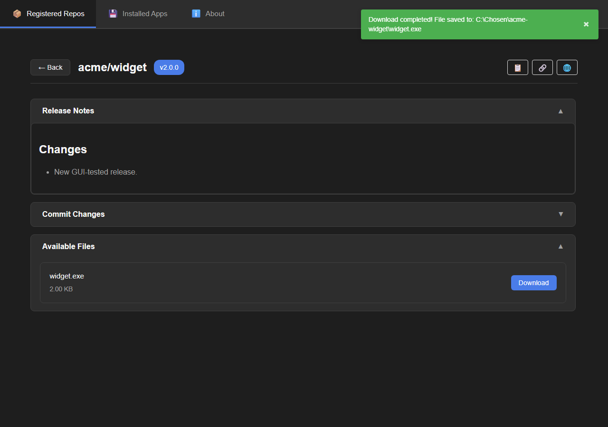
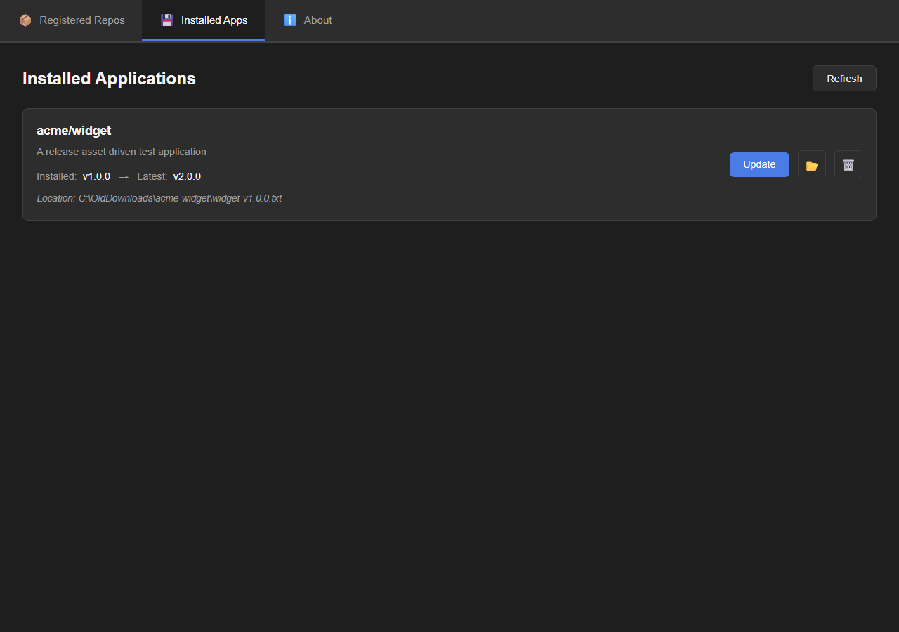
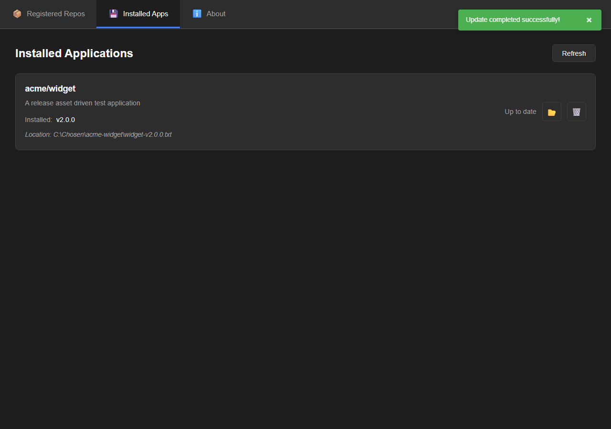
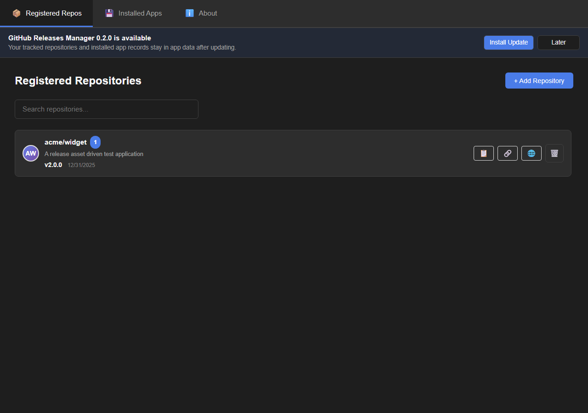

# GithubReleasesManager App

This directory contains the React/Tauri desktop app for GithubReleasesManager.

Current app version: `0.1.1`.

## Screenshots













## Development

Install frontend dependencies:

```bash
npm install
```

Start the Tauri app:

```bash
npm run tauri dev
```

Build the app:

```bash
npm run tauri build
```

## Releases And Self Updates

Tagged releases are published by the root workflow at `../.github/workflows/release.yml`. Update `package.json`, `src-tauri/Cargo.toml`, and `src-tauri/tauri.conf.json` to the new version, then push a matching tag such as `v0.1.1`, or run the workflow manually with that tag. GitHub Actions builds installers for Windows, macOS, and Linux, publishes the GitHub Release, and uploads `latest.json` for the updater.

The app checks that updater manifest on startup. When a newer signed GithubReleasesManager release exists, users can install it from the in-app banner and the app relaunches afterward. Runtime data is preserved because selected repositories, installed-app records, and API cache files are stored in the Tauri app-data directory, not inside the installed app bundle.

The release workflow requires `TAURI_SIGNING_PRIVATE_KEY` in the repository secrets. If the signing key is password protected, also set `TAURI_SIGNING_PRIVATE_KEY_PASSWORD`.

## Tests

```bash
npm run test
npm run test:gui
npm run build
npm run test:rust
```

`npm run test` runs Node's built-in test runner against shared TypeScript utilities. `npm run test:gui` starts a Vite test server with Tauri mocks, launches a Chromium-based browser, and verifies the download, installed-app update, and self-update flows.

To update visual review screenshots:

```bash
node tests/gui/run-gui-tests.mjs --screenshots
```

The command writes screenshots to `../.codex-visual-review/`. Commit-ready screenshots live in `docs/screenshots/`.

## Security Review

Security review date: 2026-05-25.

```bash
npm audit
cargo audit --file ../Cargo.lock
cargo audit --no-fetch --file src-tauri/Cargo.lock
```

Current audited dependency floor:

- `vite@6.4.2`
- `@tauri-apps/api@2.11.0`
- `@tauri-apps/cli@2.11.2`
- `@tauri-apps/plugin-dialog@2.7.1`
- `@tauri-apps/plugin-fs@2.5.1`
- `@tauri-apps/plugin-http@2.5.9`
- `@tauri-apps/plugin-opener@2.5.4`
- `@tauri-apps/plugin-process@2.3.1`
- `@tauri-apps/plugin-updater@2.10.1`
- `tauri@2.11.2`
- `tauri-build@2.6.2`
- `tauri-plugin-process@2.3.1`
- `tauri-plugin-updater@2.10.1`

`npm audit` and both Cargo lockfile scans report 0 vulnerabilities at the time of this review. Cargo still reports informational warnings from transitive desktop stack crates; see the root README for the longer note.

## Runtime Data

The backend stores app data in the Tauri app-data directory:

- `registered_repos.json`
- `installed_apps.json`
- `api_cache.json`

Downloaded assets are saved to the user-selected path. Installed-app updates download the selected latest release asset, prompt for an asset first when a release has multiple files, update the app record, and optionally delete the previous file. Repository registration accepts repo-level GitHub URLs only; branch, file, and folder URLs are rejected because GitHub releases are repository-level.
